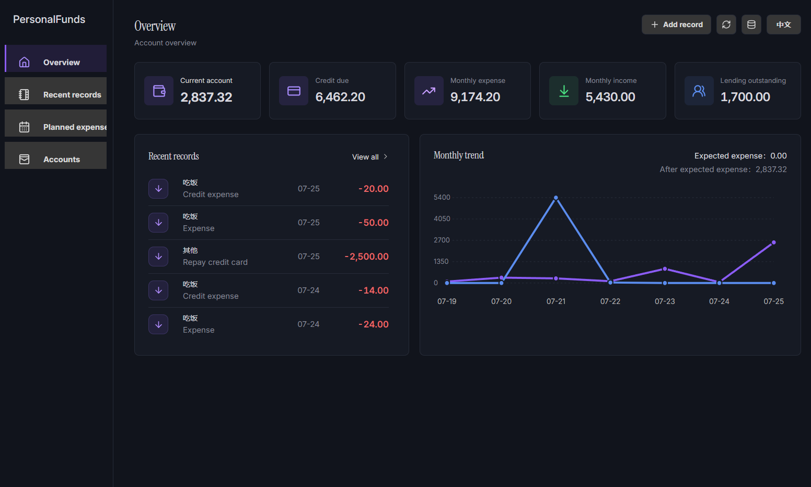
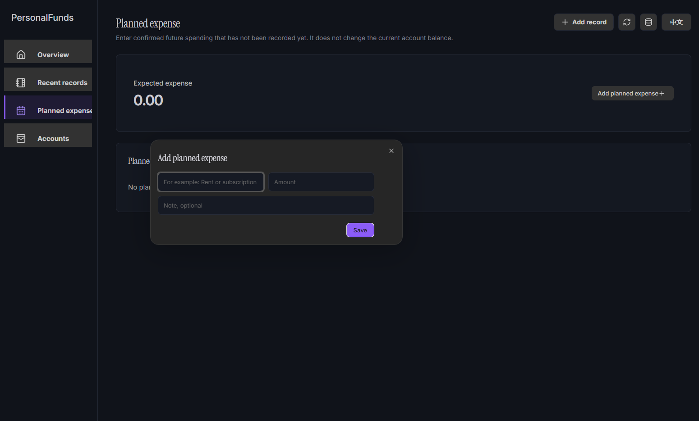
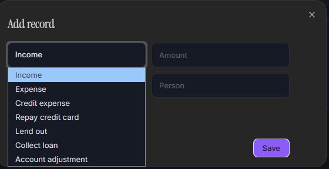

# Personal Funds

Personal Funds is a local-first Obsidian plugin for recording personal income, expenses, credit card repayments, lending, and account adjustments. Version 2.1.0 introduces a responsive dashboard designed to fill the Obsidian workspace while keeping all financial data in the vault.

## Features

- Record income, cash expenses, credit card expenses, credit card repayments, lending, loan collections, and account adjustments.
- Responsive workspace dashboard with Overview, Recent Records, Planned Expenses, Expected Income, and Account Management navigation.
- View current account, credit-card balance, monthly expense, monthly income, and lending summaries from one overview page.
- Add named planned-expense items with amount and optional note; they are included in the expected-expense total without changing the current balance.
- Add expected-income items with a name, amount, and optional note while keeping them separate from recorded transactions.
- Filter recent records by record type and category. Add new records from the compact `+ Add record` dialog.
- Display balance and monthly income/expense trends using the records stored in the vault.
- Generate a Markdown funds dashboard in your vault.
- Generate an Obsidian Canvas with the dashboard and usage guide.
- Save records to a configurable vault folder as sync-friendly Markdown (`records.md`).
- Read records back from the vault database after plugin updates or reinstalls, even if the original custom data-folder setting was not restored.
- Open and update separate Markdown summary notes from the five top summary cards.
- Preserve user-added files and Canvas nodes when updating generated dashboards.
- Switch between Chinese and English in the plugin interface.
- Store all data locally in your vault, with plugin data kept as a secondary copy.

## Usage

1. Click the wallet icon in the ribbon, or run `Open personal funds` from the command palette.
2. Use `+ Add record` in the top-right toolbar to create an income, expense, credit-card, or lending record.
3. Open **Recent Records** to filter the list by type or category.
4. Open **Planned Expenses** to add or remove future recurring/confirmed spending items.
5. Open **Expected Income** to add or remove confirmed future income items.
6. Use the top-right refresh button to update the Markdown dashboard and Canvas; use the database button to reload `records.md`.
7. Configure the data folder in the Obsidian plugin settings if you want generated files somewhere else.

## Data and Sync

The primary database is `records.md`, a normal Markdown file inside the vault. This makes the records friendly to vault sync and backups that skip `.json` files or the `.obsidian` folder. The plugin automatically imports an older `records.json` database when it is found.

Planned expenses, expected income, language preference, and records are stored in the Markdown database. Plugin data remains only a secondary local copy.

## Screenshots

### Overview dashboard

The overview brings account balances, recent records, and the monthly income/expense trend together in one responsive workspace.



### Planned expenses

Planned-expense items can be added with a name, amount, and optional note. They contribute to the expected-expense total while remaining separate from recorded transactions.



### Add a record

Use the compact record dialog to create income, expense, credit-card, lending, and adjustment records.



## Local UI Preview

The browser preview lets you test the dashboard layout and interactions without opening Obsidian. It uses sample data only; it does not read or write your vault.

```bash
pnpm install
pnpm dev
```

Then open the URL shown in the terminal (normally `http://127.0.0.1:5173`). You need a current Node.js LTS installation with pnpm available in your terminal.

## Generated Files

Personal Funds creates generated files under:

- `Personal_funds/Funds dashboard.md`
- `Personal_funds/Funds dashboard.canvas`
- `Personal_funds/records.md` (the primary record database, designed to be included by note sync tools)
- `Personal_funds/Summary/*.md`

## Privacy

Personal Funds does not send data to external services. Records, planned expenses, and expected income are saved locally in a Markdown database file in your vault and mirrored in Obsidian plugin data. Older `records.json` files are automatically imported once and migrated to `records.md`.

## Author

MI-Lin

## License

MIT
